# Full-Spectrum Review

> **An AI-native framework for deep repository-level engineering review and software maintenance.**
>
> Traditional code review asks: "Is this change correct?"  
> Full-Spectrum Review asks: "Is this system still correct?"

Full-Spectrum Review is not another PR or diff reviewer. It enables AI agents to understand and audit an entire software system — architecture, business logic, state ownership, reliability, performance, and long-term complexity — then turn scattered symptoms into evidence-verified root causes and persistent engineering assets.

**Current Core version: `v0.11.0`** · [CHANGELOG](CHANGELOG.md) · [简体中文](README.md)

## Why this exists

Most review tools are optimized for local changes: inspect a diff, find bugs, and comment on code. That is valuable, but many expensive software failures do not live inside individual lines of code.

A system can have green tests and no obvious bugs while still suffering from:

- architecture that no longer matches the real problem;
- incorrect business assumptions implemented perfectly;
- unclear ownership of state and source of truth;
- reliability mechanisms that create more failure paths than they remove;
- accidental complexity accumulated through years of patches.

Full-Spectrum Review exists to audit these system-level problems.

## Full-Spectrum Review vs traditional code review

| | PR / Diff Review | Checklist Review | Full-Spectrum Review |
|---|---|---|---|
| Scope | Changed files | Individual categories | Entire repository and system lifecycle |
| Main question | Is this change correct? | Did we check all items? | Is the system itself designed correctly? |
| Business truth | Code is assumed correct | Code is assumed correct | Business authority is reconstructed |
| Complexity | Usually invisible | Flagged by rules | Tested from first principles |
| Output | Comments | Checklist | Verified findings with lifecycle |
| Coverage | Rarely explicit | Often assumed | Coverage is recorded honestly |

## Core principles

### 1. Reconstruct the problem before judging the solution

The reviewer first derives the required outcome, irreducible constraints, and minimum sufficient mechanism. Existing architecture is treated as an answer under review, not as the definition of the question.

### 2. Audit systems, not isolated files

Important problems often exist between modules: ownership boundaries, lifecycle transitions, state synchronization, and recovery paths. Full-Spectrum Review focuses on those relationships.

### 3. Separate necessity from optimization

"Should this mechanism exist?" and "is this mechanism expensive?" are different questions. Mixing them creates incorrect fixes.

### 4. Require evidence before architectural criticism

Claims such as over-engineering require disconfirmation. Reviewers must investigate why a design exists before proposing removal.

### 5. Treat business truth as a first-class concern

Code, tests, and documentation are evidence — not automatically the definition of correctness. Domain authority and invariants must be identified first.

### 6. Make audits persistent engineering assets

Findings use stable IDs, lifecycle tracking, coverage records, and re-review support instead of disappearing into a one-time conversation.

## AI-native audit workflow

```text
Bind exact repository revision
        ↓
Build audit plan + coverage ledger
        ↓
Small target → direct audit
Medium/large target → bounded audit units
        ↓
Independent review → reviewer packets
        ↓
Evidence verification → cross-boundary checks
        ↓
Root-cause deduplication → prioritized findings
        ↓
Canonical report + persistent audit ledger
```

The framework supports:

- single-agent audits;
- sequential execution with limited context;
- parallel audit units when the harness provides workers;
- domain-specific reasoning through Domain Packs.

### Architecture and phases





> Diagram sources are `diagrams/*.mmd` (mermaid); `diagrams/*.excalidraw` files open in excalidraw.com for editing.

## Domain Packs

Full-Spectrum Review separates audit methodology from domain knowledge.

**Core defines how to audit.**  
**Domain Packs define what is true in a specific field.**

Examples:

- Trading systems
- Payment systems
- Distributed systems
- AI agent systems

The Core remains domain-neutral while Domain Packs provide domain-specific invariants and external semantics.

Verified packs so far are the trading pack (`domains/trading`) and the deploy pack (`domains/deploy`); see [CONTRIBUTING_PACKS.md](CONTRIBUTING_PACKS.md) for contributing a new pack.

## Use cases

Use Full-Spectrum Review for:

- repository-wide engineering audits;
- production-readiness assessment;
- architecture and ownership reviews;
- important PR or commit decisions;
- high-risk domains requiring specialized review knowledge.

Do not use it for a two-line change or as a replacement for tests and CI. It is designed for understanding and maintaining complex systems.

## Installation

This repository follows the Agent Skills format:

```bash
git clone https://github.com/liuyejinghong/full-spectrum-review.git .agents/skills/full-spectrum-review
```

## Updating

The current version lives in the `VERSION` file and on the [Releases](https://github.com/liuyejinghong/full-spectrum-review/releases) page; changes are listed in the [CHANGELOG](CHANGELOG.md).

```bash
# cloned install: just pull (fetch tags too)
git -C .agents/skills/full-spectrum-review pull && git -C .agents/skills/full-spectrum-review fetch --tags

# copied install: delete and re-copy, then confirm against the VERSION file
```

See the detailed workflow and contracts in [`references/`](references/).

## Project layout

```text
full-spectrum-review/
├── SKILL.md
├── VERSION
├── CHANGELOG.md
├── references/
└── domains/
```

## License

MIT
