# Full-Spectrum Review

> **面向 AI Agent 的软件系统级深度审计框架。**
>
> 普通 Code Review 关注：“这次改动有没有问题？”  
> Full-Spectrum Review 关注：“整个系统本身是否仍然正确？”

Full-Spectrum Review 不是又一个 PR / Diff Reviewer。它帮助 AI Agent 理解并审查完整软件系统：架构、业务逻辑、状态所有权、可靠性、性能与长期复杂度，并将局部症状收敛为经过证据验证的系统级根因，沉淀为可持续复审的工程资产。

**当前 Core 版本：`v0.10.0`** · [CHANGELOG](CHANGELOG.md) · [English](README.en.md)

## 为什么需要它

大多数 Review 工具针对局部变化：查看 diff、发现代码问题、提出修改建议。

但真实软件系统中最昂贵的问题，往往不在某一行代码里：

- 架构已经偏离真正要解决的问题；
- 业务规则从一开始就被错误理解；
- 状态所有权和事实来源不清晰；
- 为历史事故堆叠出的机制制造更多复杂度；
- 测试全部通过，但系统仍然在错误的问题上给出了正确答案。

Full-Spectrum Review 的目标，就是审查这些系统级问题。

## 与传统 Code Review 的区别

| | PR / Diff Review | Checklist Review | Full-Spectrum Review |
|-|-|-|-|
| 范围 | 修改文件 | 分类检查项 | 整个项目与生命周期 |
| 核心问题 | 这次改动正确吗？ | 是否检查完整？ | 系统本身是否设计正确？ |
| 业务真相 | 默认代码正确 | 默认代码正确 | 先建立业务权威地图 |
| 复杂度 | 通常不可见 | 规则化检查 | 第一性原理验证 |
| 产出 | 评论 | 清单 | 可复审的审计报告 |
| 覆盖 | 通常不说明 | 容易假设完成 | 覆盖台账明确记录 |

## 六个核心判断

### 1. 先重建问题，再接受方案

审查设计前，AI Reviewer 会重新推导真实目标、不可约束和最小充分机制。现有架构是待审答案，而不是问题定义。

### 2. 审查系统，而不是孤立文件

关键问题通常存在于模块之间：状态流转、所有权边界、生命周期和恢复机制。

### 3. 区分“是否应该存在”和“是否成本过高”

必要性和优化是两个不同问题。混淆二者会导致错误优化。

### 4. 批评复杂度前必须寻找反证

任何“过度设计”判断，都需要先调查它为什么存在：历史提交、测试、调用方和运行约束。

### 5. 业务真相不默认等于代码

代码、测试和文档都是证据，不自动代表业务正确。领域约束和权威来源必须先被识别。

### 6. 审计结果应该成为长期工程资产

Finding 使用稳定 ID、生命周期和覆盖记录保存，而不是一次聊天后消失。

## AI-native 审计流程

```text
锁定精确版本
        ↓
建立审计计划 + 覆盖台账
        ↓
小项目直接审查
中大型项目拆分 Audit Unit
        ↓
独立审查 → Reviewer Packet
        ↓
证据验证 → 跨模块核验
        ↓
根因去重 → 优先级排序
        ↓
权威报告 + 持久审计台账
```

支持：

- 单 Agent 审计；
- 有限上下文下的串行 Audit Unit；
- 支持 Worker 的并行审计；
- 基于 Domain Pack 的领域审查。

### 架构与阶段





> 图源为 `diagrams/*.mmd`（mermaid 源码），`diagrams/*.excalidraw` 可在 excalidraw.com 打开编辑。

## Domain Pack

Full-Spectrum Review 将“如何审查”和“这个领域什么是真实约束”分离。

**Core 定义审计方法。**  
**Domain Pack 提供领域事实。**

例如：

- 量化交易系统；
- 支付系统；
- 分布式系统；
- AI Agent 系统。

目前经过验证的 pack 有交易 pack（`domains/trading`）与发版 pack（`domains/deploy`）；新 pack 的贡献方式见 [CONTRIBUTING_PACKS.md](CONTRIBUTING_PACKS.md)。

## 适用场景

适合：

- 整个仓库的深度审计；
- 生产上线前评估；
- 架构和所有权审查；
- 重要 PR / Commit 决策；
- 高风险领域系统维护。

不适合：

- 两行代码的小修改；
- 替代测试和 CI；
- 未授权情况下直接修改被审系统。

## 安装

本项目遵循 Agent Skills 格式：

```bash
git clone https://github.com/liuyejinghong/full-spectrum-review.git .agents/skills/full-spectrum-review
```

## 更新

当前版本见 `VERSION` 文件与 [Releases](https://github.com/liuyejinghong/full-spectrum-review/releases) 页，变更见 [CHANGELOG](CHANGELOG.md)。

```bash
# clone 安装：pull 即可（建议带上 tag）
git -C .agents/skills/full-spectrum-review pull && git -C .agents/skills/full-spectrum-review fetch --tags

# 拷贝安装：删了重拷，装完对照 VERSION 文件确认版本
```

详细规则位于 [`references/`](references/)。

## License

MIT
